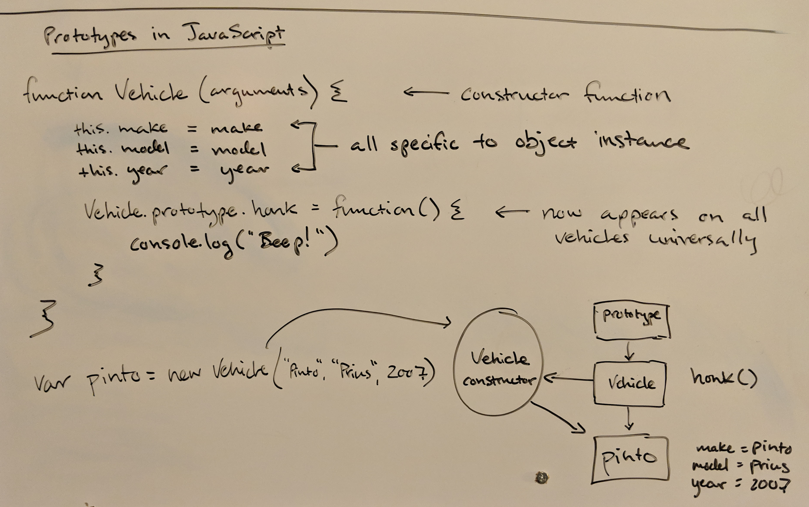

Prototypes in JavaScript feel natural to me, because I first learned Object Oriented Programming when Java was the next big thing.  I remember when the Java Virtual Machine and its promise of portability was all the rage.



Or, in easier to read code, this function helps illustrate the idea better:
``` javascript
function Vehicle(arguments) { // This is a constructor function
  // The use of 'this' means that each one of these assignments is specific to the instance of this object
  this.make = make
  this.model = model
  this.year = year
  Vehicle.prototype.honk = function() { // The use of prototype here means honk() will appear on all vehicles
    console.log("Beep!")
  }
}
// Demonstrate creating an actual vehicle object
var pinto = new Vehicle("Ford", "Pinto", 1975)
```

[Prototypical inheritance](https://developer.mozilla.org/en-US/docs/Web/JavaScript/Inheritance_and_the_prototype_chain) is covered thoroughly by the excellent Mozilla developer docs. 
