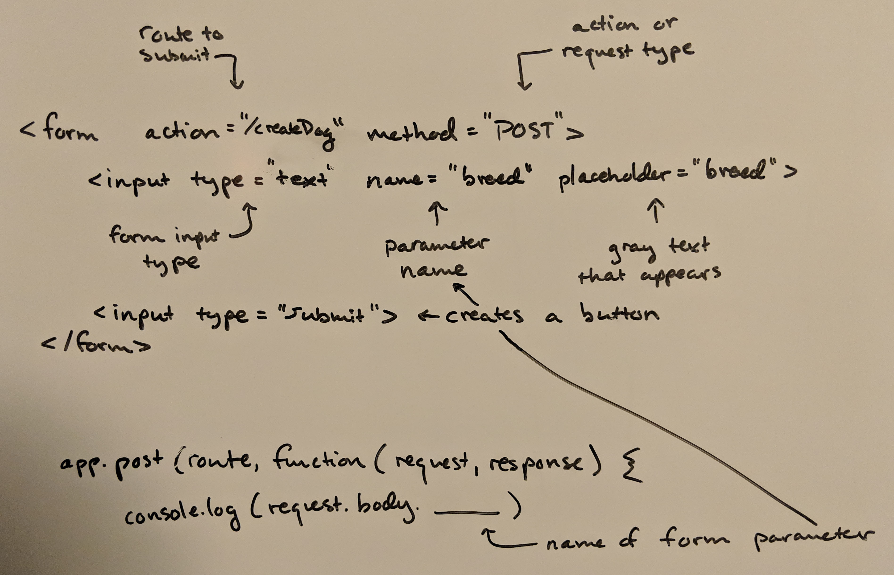

An HTML form is a powerful tool that allows you to create data and receive (or catch) it somewhere else.

Fausto García via [Unsplash](https://unsplash.com/photos/hYKG311mff8)

And in clean HTML code, here's a form that sends to an action "/createDog" endpoint (URL).  If this form were on rchillard.com, then it would send data to rchillard.com/createDog:
```html
<form action="/createDog" method="POST">
  <input type="text" name="breed" placeholder="breed">
  <input type="submit">
</form>
```

In order to catch that data, you need a server.  I have been learning [Node.js](https://nodejs.org/en/) and [Express](https://www.npmjs.com/package/express).  Express is a web framework.  The line below is a basic route that accepts a POST request from the form above (more on this later):
```javascript
app.post(route, function(request, response) {
  console.log(request.body.breed) // The final parameter here, "breed", is the name in the form action above
}
```

So, there you have it!  With these two things, a form to *send data* and a server to *receive data* we can start thinking about storing data.
