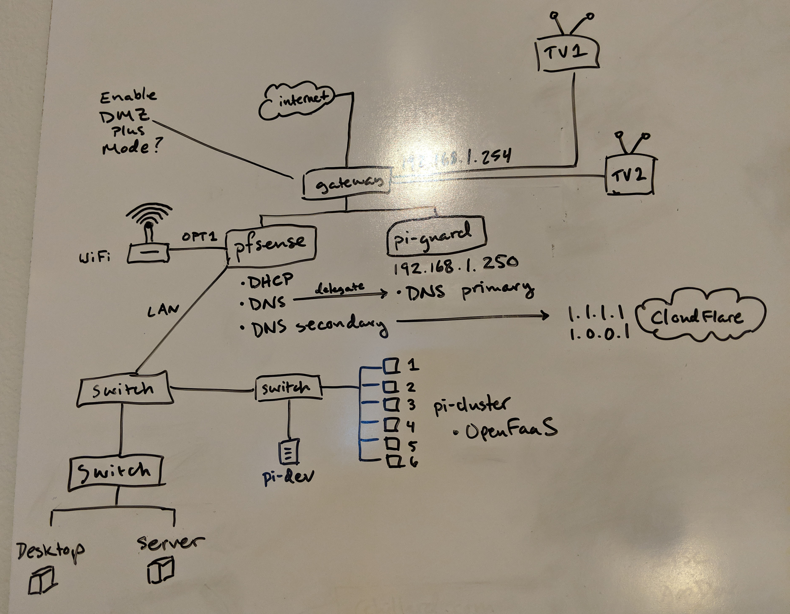

I have been hard at work re-learning some networking fundamentals, and as a result, I decided to completely re-engineer my home network.  There are compelling privacy and security reasons for doing this, but for me, it's also a great chance to learn some networking and system administration skills with a hands-on project.
:open_hands:

With this project I wanted to solve a few specific problems I had with security, productivity, and privacy.

## Security Problem
As it turns out, most internet service providers provide fairly poor routers.  These routers have problems like:
* Unpatched system vulnerabilities
* Depend on weak encryption methods
* No way to use services that ensure privacy

### Solution
Deploy a firewall behind my router with enterprise features that I can manage myself!  Enter [pfSense](https://www.pfsense.org/).  Here are some features I wanted:
* VLAN support, configurable routing
* DNS controls like dnyamic DNS and DNS forwarding
* Site-to-site and remote access VPN support

For setting up pfSense and learning how to administrate a real firewall, I highly recommend this playlist from Mark Furneaux, [Comprehensive Guide to pfSense 2.3](https://www.youtube.com/playlist?list=PLE726R7YUJTePGvo0Zga2juUBxxFTH4Bk).

## Productivity Problem
Our modern world is full of digital [skinnerboxes](https://en.wikipedia.org/wiki/Operant_conditioning_chamber).  These are web and mobile apps that you probably know and love like Facebook, Instagram, and Reddit.  They are designed to purposefully condition you to keep using them.  This is primarily through cheap dopamine delivered in the form of content feeds that scroll forever.

My skinnerbox, my cheap dopamine addiction, was Reddit.  I needed a way to reduce my usage and focus.  I'd read Reddit on the train, in the car, when I woke up, before I went to bed, and I realized that it was eating hours of my day.

### Solution
My solution was to block the entire domain on my home network, so if I was at home (when I was supposed to be learning), I was incapable of being distracted by Reddit.  I could block the domain on the pfSense router, but I also wanted to add network level ad blocking as well.

Enter [Pi-Hole](https://pi-hole.net/).  Pi-hole is a free piece of software that will run on a Raspberry Pi and block domains that serve common advertisements, as well as give you fine grained control over any other domains you'd like to block.  I delegated DNS through the pfSense router to my pi-hole, and now the pi-hole handles DNS for any device on the network.  This is handy, because you can now easily start blocking any other skinnerboxes that might crop up to take Reddit's place.

## Privacy Problem
Personal privacy on the internet is very important.  An important part of privacy is protecting your DNS queries.  When you visit a website, even an encrypted one, your DNS queries are unencrypted, meaning your ISP, by default, can see every site you're visiting.  With the recent reduction of net neutrality rules, those same ISPs can also sell this data.  That's scary! :fearful:

### Solution
Cloudflare is helping combat this through their [1.1.1.1 privacy oriented DNS service](https://blog.cloudflare.com/announcing-1111/), and you can configure your Pi-Hole to use it through DNS-over-HTTPS.  Scott Helme wrote an [excellent guide on how to do this](https://labs.ripe.net/Members/scott_helme/securing-dns-across-all-of-my-devices), which I will not re-create here.  Go check it out!

## Home Network v1.0
So, here's a diagram of the first version of my new home network:

