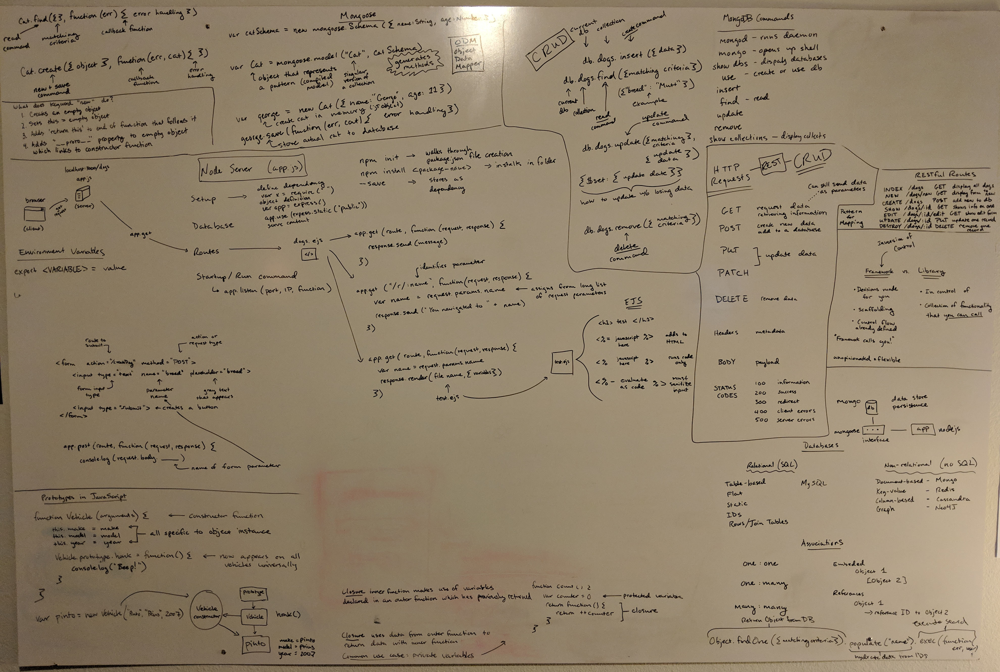

I have installed a marker board in my office, so I can start thinking outloud, in dry erase marker, literally on the walls.  I have found this incredibly helpful for tracking my learning.  

Little known fact: you don't have to spend hundreds of dollars on a fancy storebought marker board.  

You can buy your own from Home Depot or Lowes for $10 :relieved::
[How to Make a Big DIY Whiteboard](https://thriftdiving.com/how-to-make-a-big-diy-whiteboard-get-organized/)

I started my own self-driven web developer bootcamp this last summer, and although it took me a long time to work through it, I've finally finished.  This whiteboard has been superb for helping me process ideas, refer back to them, and commit my learnings to memory.  Here are the basic steps I've found helpful:
1. Read the lesson
2. Draw the concept on the board
3. Complete the exercise or build a project
4. Return and annotate the drawn concept with code 
5. Capture the learnings by translating them into your own words

This blog is my way of completing step 5: capturing my learnings. 
 
To *illustrate* my point, here's what my whiteboard looked like during one part of the course:

P.S. I am going to be posting a saved up cache of lessons over the next month!  
