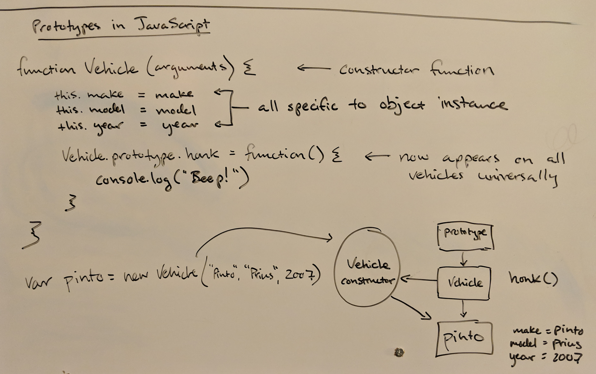

Prototypes in JavaScript feel natural to me, because I first learned Object Oriented Programming when Java was the next big thing.  I remember when the Java Virtual Machine and its promise of portability was all the rage.  Here's a sketch from my marker board breaking down how prototypes and constructors work:



Or, in easier to read code, this function helps illustrate the idea better:
``` javascript
function Vehicle(arguments) { // This is a constructor function
  // The use of 'this' means that these assignments are specific to the instance of this object
  this.make = make
  this.model = model
  this.year = year
  Vehicle.prototype.honk = function() { // Honk() will appear on all vehicles
    console.log("Beep!")
  }
}
// Demonstrate creating an actual vehicle object
var pinto = new Vehicle("Ford", "Pinto", 1975)
```

The core idea is that all JavaScript objects exist in a hierarchy of objects.  The prototype of any given object is its parent object.  You can exploit this hiearchy for great justice by creating functions and variables that will be shared across all instances of an object.  You can do this by adding them to that object's prototype.  There's a whole lot more on this concept of [prototypical inheritance](https://developer.mozilla.org/en-US/docs/Web/JavaScript/Inheritance_and_the_prototype_chain) which is covered thoroughly by the excellent Mozilla developer docs. 
