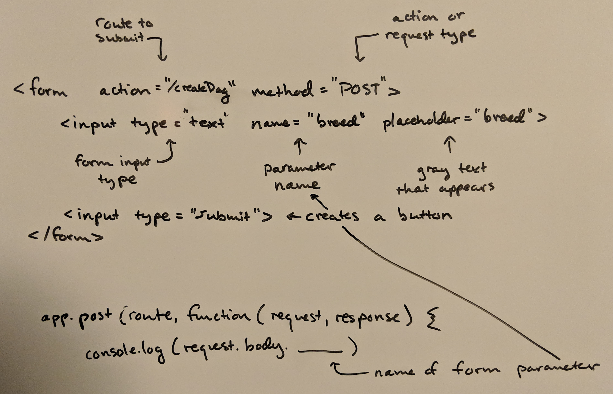

An HTML form is a powerful tool that allows you to capture data and transmit it.  Here's a basic one:


And in clean HTML code, here's that same form that sends to an action "/createDog" endpoint (URL).  If this form were on rchillard.com, then it would send data to rchillard.com/createDog:
```html
<form action="/createDog" method="POST">
  <input type="text" name="breed" placeholder="breed">
  <input type="submit">
</form>
```

In order to catch that data, you need a server.  I have been learning [Node.js](https://nodejs.org/en/) and [Express](https://www.npmjs.com/package/express).  Express is a web framework.  The line below is a basic route that accepts that transmitted data (via a POST request, shown in the method parameter) from the form above:
```javascript
app.post(route, function(request, response) {
  // The final parameter here below, "breed", is the name in the form action above
  console.log(request.body.breed) 
}
```

This is a small snippet of server side code in a larger Express application.  I'll be sharing more of my learnings in that area later.  So, there you have it!  With these two things, a form to *send data* and a server to *receive data* we can start storing data.  This makes up the foundational capabilities of all modern web applications.
