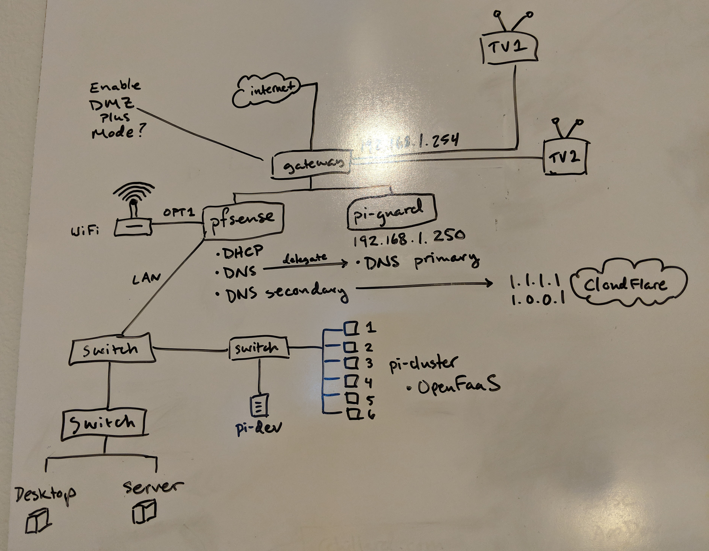

I have been hard at work re-learning some networking fundamentals, and as a result I decided to completely re-engineer my home network.  There are compelling privacy and security reasons for doing this, but for me it's also a great chance to learn some networking and system administration skills with a hands-on project.
:open_hands:

With this project I wanted to solve a few specific concerns I had with my security, personal productivity, and privacy.

## Security Problem
As it turns out, most internet service providers provide fairly poor routers/gateways.  These devices have problems like they:
* Contain unpatched system vulnerabilities
* Depend on weak encryption methods
* Lack functionality to let you segregate devices on your network

### Solution
Deploy a firewall behind my router with enterprise features that I can manage myself!  Enter [pfSense](https://www.pfsense.org/).  pfSense is a free, open source network firewall (software) based on the FreeBSD operating system.  It has features typical of an enterprise firewall, such as:
* VLAN support, configurable routing
* DNS controls like dynamic DNS and DNS forwarding
* Site-to-site and remote access VPN support

This approach lets me do interesting things like keep my wifi network separate from my ethernet network.  For setting up pfSense and learning how to administrate a real firewall, I highly recommend this YouTube playlist from Mark Furneaux, [Comprehensive Guide to pfSense 2.3](https://www.youtube.com/playlist?list=PLE726R7YUJTePGvo0Zga2juUBxxFTH4Bk).

## Productivity Problem
Our modern world is full of digital [skinnerboxes](https://en.wikipedia.org/wiki/Operant_conditioning_chamber).  These are web and mobile apps that you've probably heard of like Facebook, Instagram, and Reddit.  They are designed to purposefully condition you to keep using them.  This conditioning is achieved through "features" like content feeds that scroll forever.  The human brain loves new things, so this neverending stream of novelty means a lot of cheap dopamine.

My skinnerbox, my cheap dopamine addiction, was Reddit.  I needed a way to reduce my usage, so I could focus on my personal development and goals.  I have been procrastinating for years.  Tim Urban has an amusing and thought provoking [TED talk](https://www.ted.com/talks/tim_urban_inside_the_mind_of_a_master_procrastinator) on the unseen dangers that this behavior brings.  If you're a procrastinator, then I recommend you watch it and take Mr. Urban's warnings to heart.  I'd read Reddit on the train, in the car, when I woke up, before I went to bed.  I was a master procrastinator and Reddit was my primary tool.  I realized that it was stealing hours of my day.

### Solution
My solution was to block the entire domain on my home network, so if I was at home (when I was supposed to be learning), I was incapable of being distracted by Reddit.  I could block the domain on the pfSense router, but I also wanted to add network level ad blocking as well.

Enter [Pi-hole](https://pi-hole.net/).  Pi-hole is a free piece of software that will run on a Raspberry Pi and block domains that serve common advertisements, as well as gives you fine grained control over any other domains you'd like to blacklist.  I delegated DNS through the pfSense router to my pi-hole, and now the pi-hole handles DNS for any device on the network.  This is handy, because you can now easily start blocking any other skinnerboxes that might crop up to take Reddit's place.

## Privacy Problem
Personal privacy on the internet is very important.  An important part of privacy is protecting your DNS queries.  When you visit a website, even an encrypted one, your DNS queries are unencrypted by default, meaning your ISP can see every site you're visiting.  With the recent reduction of net neutrality rules, those same ISPs can also sell this data.  That's scary! :fearful:

### Solution
Cloudflare is helping combat this through their [1.1.1.1 privacy oriented DNS service](https://blog.cloudflare.com/announcing-1111/), and you can configure your Pi-Hole to use it through DNS-over-HTTPS.  When you use DNS-over-HTTPS your queries are encrypted, so casual observers cannot snoop in on what sites you're visiting.  Scott Helme wrote an [excellent guide on how to do this](https://labs.ripe.net/Members/scott_helme/securing-dns-across-all-of-my-devices), which I will not re-create here.  Go check it out!

## Home Network v1.0
It took over a week of work to research, learn, implement, test, and then deploy this setup, but I am pretty proud of it.  There's also a few extra goodies on this diagram (like my cluster of Raspberry Pi computers) that I will save to go over in a future post.

So, here's a diagram of the first version of my new home network:

