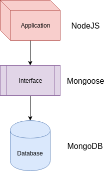

[Mongoose](https://www.npmjs.com/package/mongoose) is an Object Data Mapper (ODM) which makes it easier for a NodeJS application to interact with MongoDB.  It provides standard functions that allow you to model data through schemas.  

## Understanding Connections
Before we dive in, I like to see the big picture.  How do all these pieces fit together?  
The puzzle looks like this:



Mongoose sits in between NodeJS and MongoDB and acts as the interface in Node for the database.

## Models and Schemas
A data model defines the shape of data or how each piece of data is connected to each other and how they are processed and stored inside a system.  A schema is a way to define a data model.  Let's learn through a few examples:
```javascript
var dogSchema = new mongoose.Schema({ name: String, age: Number })
// Schema is used to define a new model
// The shape of the data is defined here

var Dog = mongoose.model("Dog", dogSchema)
// Dog is an object that represents a pattern (a compiled model)
// The first parameter "Dog" is the singular version of a collection
// mongoose.model takes the second parameter, dogSchema, and generates methods

var fido = new Dog({ name: "Fido", age: 11})
// Creates an actual dog in memory (JavaScript object)

fido.save(function(err, dog) { error handling happens here })
// Stores the actual dog in the database
```
So how does this work inside a NodeJS application?

## Connecting the Dots
I am going to avoid recreating an entire tutorial on Mongoose and MongoDB.  There are already plenty out there, so my notes here will only be to support my own understanding and serve as a reference guide for future me.  If these are too sparse, please refer to another resource.

First, you have to connect to your MongoDB instance.
```javascript
// Setup Database/Dependency and Connect
// Use mongoose as object-data-mapper
var mongoose = require("mongoose")
// Connect to the database
mongoose.connect('mongodb://localhost:27017/test_db', { useNewUrlParser: true })
```

Next, remember you can separate out your models into separate files for cleanliness.  These are the sample contents of a models/user.js file:
```javascript
var mongoose = require("mongoose")

var UserSchema = new mongoose.Schema({
    username: String,
    password: String
})

module.exports = mongoose.model("User", UserSchema)
```

Since this model has been exported, you can import it elsewhere and then utilize it to create new users or look up users.  Here's some sample code to help illustrate how this works:
```javascript
// Import mongoose model
var User = require("user")

// Create a new user with pattern below:
// User.create({ object }, function(err, user) { error handling here })
// User.create is the combination of both the new and save commands/functions
User.create({ username: "rchillard", password: "12345strongpassword" }, function(err, user) {
    if (err) {
        console.log(err)
    } else {
        console.log(user)
    }
})

// Query for an object using Mongoose method
// User.find is the essential READ command and it's structured as:
// User.find({ matching criteria }, function(err) { error handling })
User.findById({ username: "rchillard" }, function(err, foundUser) {
    if (err) {
        console.log(err)
    } else {
        console.log(foundUser))
    }
})
```
Please don't ever actually create users and passwords as above.  This was just sample code.  I recommend you checkout [Passport](http://www.passportjs.org/), a Node.js package that specializes in authentication.

## Conclusion
Mongoose serves as a layer or interface between your application and your database, and that saves you from having to write duplicative code or worry about lower level concerns.  This post helped to illustrate how models and schemas work to realize that dream of ease.

Hans Veth via [Unsplash](https://unsplash.com/photos/rpusvLxS0oA)

Let's get fancy and preview something more advanced:
```javascript
Object.findOne({matching criteria}).populate("name").exec(function (err, user){ do something })
// Return object from the database - hydrate data from the IDs - execute search with callback
```

Checkout what this does by reading the [Mongoose docs](https://mongoosejs.com/docs/populate.html).  They're a pretty *quick* read.