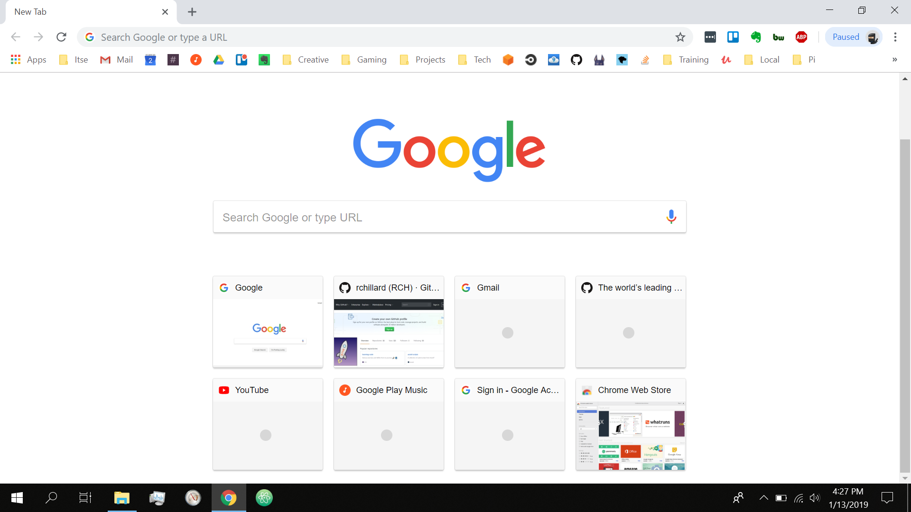
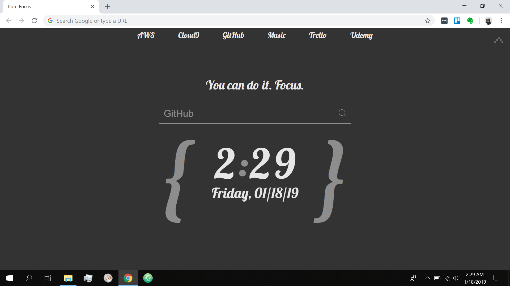

I used to have a really big problem.  I used to be a terrible procrastinator.  I am way too good at distracting myself from what I should be doing.  I'm changing that though, and I'm doing it by assuming power over my sources of distraction and adding a little *friction*.

## Distractions Abound
One of my biggest sources of distraction is the internet (I know, big surprise!), but what I found is that I had engineered my browsing experience to be what I considered super productive, yet was actually just a clever way to procrastinate more.  My problem was bookmarks.  

Check out this bookmarks bar and new tab experience below:

Look at how many different things I could click on!  Common sources of distraction abound:
- Email
- Slack
- Evernote
- Creative folder
- Gaming folder
- Projects folder (the worst!)

What I discovered is that being faced constantly *on every browser window, in every tab* with a list of super easy-to-click on distractions... meant that I was tempted more to be distracted, which meant I indulged more, which meant I never got anything done! :angry:

## A Little Friction
What I've learned from excellent articles like [How to Break a Bad Habit](https://jamesclear.com/how-to-break-a-bad-habit) by James Clear is that I need to add a little friction, if I am going to break a bad habit.  Basically, bad habits are learned and ingrained in us through practice.  Like anything, the more we do it, the better we get at it, even if it's something bad.  You can play an [interrupt card](https://scryfall.com/card/a25/50/counterspell?utm_source=mw_MTGWiki) on it though by adding a little friction.  Friction can be anything that makes you pause before doing the habit and think, "Wait, am I doing the right thing here?"  Friction makes it harder to do whatever you're avoiding.  A simple example would be putting the healthy food in the front of your refrigerator and hiding the unhealthy stuff in the back.

For my unhealthy procrastinating, the first step was getting rid of that bookmarks bar:

## Default to Focus
As you can see above, the window is a lot cleaner!  Distractions are gone.  Here are the changes I made:
1. Removed the bookmarks bar completely
2. Reduced the number of extensions (next to URL bar)
3. Installed [CaretTab](https://chrome.google.com/webstore/detail/carettab-new-tab-clock-an/cojpndognjdcakkimaloeealehpkljna?hl=en) to enhance my focus

CaretTab is a browser extension that loads a custom default screen with all the tools I need for projects:
- Amazon Web Services (AWS) for my cloud infrastructure
- Cloud9 is my remote development environment
- GitHub to store my code
- Music to help me concentrate
- Trello to track my 'to do' list
- Udemy is my primary online learning tool

From the options above, I have nothing that can distract me.  Literally, every link is for *focus*.

In addition, I added an encouraging message, "You can do it.  Focus."  And these sorts of little things should **not** be underestimated!  They're really important for keeping your mind at ease.  I'll post more on this later.

And finally, the current time, so I am aware of how much time I have left to finish any given task.

## Conclusion
I changed the amount of time I spent distracted by meaningless things like email, chat, and Reddit by adding a little friction between my bad habit and my ability to exercise that habit.  That pause in my routine opened an opportuntiy for me to default to focus.  Shape your environment to support your goals, design it to support your focus, and you will reap the rewards.